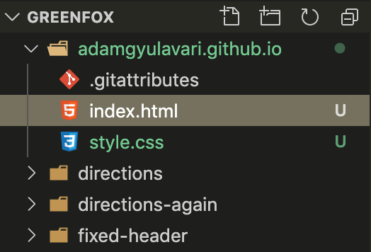

# Webpage with GitHub

## Help

- [Questions to this exercise](http://askbot.greenfox.academy/questions/tags:github-io/)

## Step by step

- Create a new repository with the name convention like: ***your-github-name.github.io***
  - Where `your-github-name` should be your username on GitHub, mine would look like this for example: `adamgyulavari.github.io`
- Publish your repository and make sure to untick *Keep this code private*
- Copy the content of the website what you made at `My first website` workshop day
  - Just the `dist` folder's content, so an `index.html` and the `style.css` should be in the folder
  - So you should have something like this as a folder and file structure:

> Note: VS Code can automatically detect if a folder is a repository and highlight (in green for example) changed files and folders. Don't worry if you don't see this, you can still use GitHub Desktop to see the changed files in your repository and push the changes.

- Commit your changes and push origin (or Publish it if you haven't already)
- Now you can check ***your-github-name.github.io*** in your browser, and send everyone what you made before :)
  - Not the repository page on GitHub, but that as address used in the browser
- Make some change, push again, and check the differences
  - It usually takes a while for GitHub to update the content, so don't be afraid if it doesn't appear immediately

> Note: You can put folders and other solutions into this repository or other HTML files like `solutions.html` and that'll be available at `your-github-name.github.io/solutions.html`. The only thing you have to be careful about is not to put a repository folder into another repository folder. That won't work well. If you've done this by accident in the GitHub Desktop app you'll see that a folder is added but you won't see any changes like for the files. You should not see a folder in the change list ever actually, because even if you add a new folder and files into that, you'll see only the files in the change list with their location (so they're in a folder). In this case just move the repository folder out and copy back just the files from it you need.
